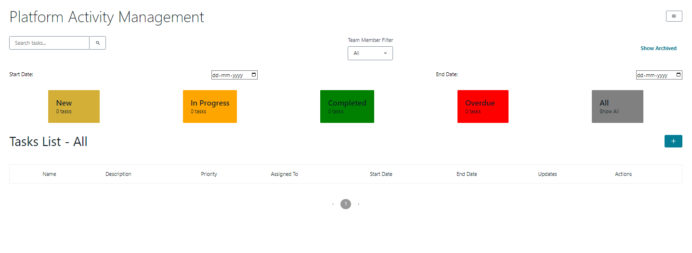
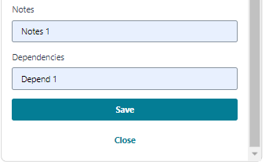

# Task-Management-App

## CURRENTLY DEVELOPMENT OF THIS APP IS INPROGRESS.

#### Screenshots:







#### Data:

psql -h localhost -p 5432 -U postgres

\l
task_management
\c task_management

postgres-# \c task_management
You are now connected to database "task_management" as user "postgres".
task_management-# \dt
           List of relations
 Schema |   Name    | Type  |  Owner
--------+-----------+-------+----------
 public | audit_log | table | postgres
 public | notes     | table | postgres
 public | tasks     | table | postgres
 public | users     | table | postgres
(4 rows)

Check the column names in the `notes` table and ensure you are altering the correct one. To confirm the columns, you can run:

```sql
\d notes
```

task_management-# \d tasks
                                            Table "public.tasks"
    Column    |            Type             | Collation | Nullable |                Default

--------------+-----------------------------+-----------+----------+---------------------------------
-------
 task_id      | integer                     |           | not null | nextval('tasks_task_id_seq'::reg
class)
 user_id      | integer                     |           |          |
 title        | character varying(255)      |           | not null |
 description  | text                        |           |          |
 priority     | character varying(50)       |           |          |
 status       | character varying(50)       |           |          | 'pending'::character varying
 start_date   | date                        |           |          |
 end_date     | date                        |           |          |
 dependencies | text                        |           |          |
 created_at   | timestamp without time zone |           |          | CURRENT_TIMESTAMP
 updated_at   | timestamp without time zone |           |          | CURRENT_TIMESTAMP
 created_by   | integer                     |           |          |
 updated_by   | integer                     |           |          |
 assigned_to  | integer                     |           |          |
 is_deleted   | boolean                     |           |          | false
Indexes:
    "tasks_pkey" PRIMARY KEY, btree (task_id)
Foreign-key constraints:
    "tasks_assigned_to_fkey" FOREIGN KEY (assigned_to) REFERENCES users(user_id)
    "tasks_created_by_fkey" FOREIGN KEY (created_by) REFERENCES users(user_id)
    "tasks_updated_by_fkey" FOREIGN KEY (updated_by) REFERENCES users(user_id)
    "tasks_user_id_fkey" FOREIGN KEY (user_id) REFERENCES users(user_id)
Referenced by:
    TABLE "audit_log" CONSTRAINT "audit_log_task_id_fkey" FOREIGN KEY (task_id) REFERENCES tasks(task
_id) ON DELETE SET NULL
    TABLE "notes" CONSTRAINT "notes_task_id_fkey" FOREIGN KEY (task_id) REFERENCES tasks(task_id) ON
DELETE CASCADE


task_management-# \d notes
                                           Table "public.notes"
   Column   |            Type             | Collation | Nullable |                Default

------------+-----------------------------+-----------+----------+-----------------------------------
-----
 note_id    | integer                     |           | not null | nextval('notes_note_id_seq'::regcl
ass)
 task_id    | integer                     |           | not null |
 username   | character varying(255)      |           |          |
 created_by | integer                     |           |          |
 updated_by | integer                     |           |          |
 note_text  | text                        |           | not null |
 created_at | timestamp without time zone |           |          | now()
 updated_at | timestamp without time zone |           |          | now()
Indexes:
    "notes_pkey" PRIMARY KEY, btree (note_id)
Foreign-key constraints:
    "notes_task_id_fkey" FOREIGN KEY (task_id) REFERENCES tasks(task_id) ON DELETE CASCADE


task_management-# \d users
                                      Table "public.users"
   Column   |            Type             | Collation | Nullable |           Default
------------+-----------------------------+-----------+----------+------------------------------
 user_id    | integer                     |           | not null | generated always as identity
 name       | character varying(255)      |           | not null |
 email      | character varying(255)      |           | not null |
 password   | character varying(255)      |           | not null |
 user_role  | character varying(50)       |           | not null |
 created_at | timestamp without time zone |           |          | CURRENT_TIMESTAMP
Indexes:
    "users_pkey" PRIMARY KEY, btree (user_id)
    "users_email_key" UNIQUE CONSTRAINT, btree (email)
Check constraints:
    "users_user_role_check" CHECK (user_role::text = ANY (ARRAY['admin'::character varying, 'user'::c
haracter varying]::text[]))
Referenced by:
    TABLE "tasks" CONSTRAINT "tasks_assigned_to_fkey" FOREIGN KEY (assigned_to) REFERENCES users(user
_id)
    TABLE "tasks" CONSTRAINT "tasks_created_by_fkey" FOREIGN KEY (created_by) REFERENCES users(user_i
d)
    TABLE "tasks" CONSTRAINT "tasks_updated_by_fkey" FOREIGN KEY (updated_by) REFERENCES users(user_i
d)
    TABLE "tasks" CONSTRAINT "tasks_user_id_fkey" FOREIGN KEY (user_id) REFERENCES users(user_id)


task_management-# \d audit_log
                                           Table "public.audit_log"
   Column    |            Type             | Collation | Nullable |                  Default

-------------+-----------------------------+-----------+----------+----------------------------------
---------
 log_id      | integer                     |           | not null | nextval('audit_log_log_id_seq'::r
egclass)
 task_id     | integer                     |           |          |
 field_name  | character varying(255)      |           |          |
 old_value   | text                        |           |          |
 new_value   | text                        |           |          |
 changed_by  | integer                     |           |          |
 change_date | timestamp without time zone |           |          | now()
Indexes:
    "audit_log_pkey" PRIMARY KEY, btree (log_id)
Foreign-key constraints:
    "audit_log_task_id_fkey" FOREIGN KEY (task_id) REFERENCES tasks(task_id) ON DELETE SET NULL


task_management-# \dt users
         List of relations
 Schema | Name  | Type  |  Owner
--------+-------+-------+----------
 public | users | table | postgres
(1 row)


task_management-# \dt tasks
         List of relations
 Schema | Name  | Type  |  Owner
--------+-------+-------+----------
 public | tasks | table | postgres
(1 row)


task_management-# \dt notes
         List of relations
 Schema | Name  | Type  |  Owner
--------+-------+-------+----------
 public | notes | table | postgres
(1 row)


task_management-# \dt audit_log
           List of relations
 Schema |   Name    | Type  |  Owner
--------+-----------+-------+----------
 public | audit_log | table | postgres
(1 row)

task_management=# TABLE users;
 user_id |  name   |        email        | password | user_role |         created_at
---------+---------+---------------------+----------+-----------+----------------------------
       1 | ABC    | ABC@example.com    | "" | user      | 2024-09-22 14:17:44.637547
       2 | XYZ | XYZ@example.com | "" | user      | 2024-09-22 14:17:44.637547


task_management=# TABLE TASKS;
 task_id | user_id | title | description | priority | status | start_date | end_date | dependencies |
 created_at | updated_at | created_by | updated_by | assigned_to | is_deleted
---------+---------+-------+-------------+----------+--------+------------+----------+--------------+
------------+------------+------------+------------+-------------+------------
(0 rows)


task_management=# TABLE NOTES;
task_management=# TABLE NOTES;
 note_id | task_id | username | created_by | updated_by | note_text | created_at | updated_at
---------+---------+----------+------------+------------+-----------+------------+------------
(0 rows)


task_management=# TABLE AUDIT_LOG;
 log_id | task_id | field_name | old_value | new_value | changed_by | change_date
--------+---------+------------+-----------+-----------+------------+-------------
(0 rows)

npm start
node server.js 
Server running on port 5000

Compiled successfully!

You can now view task-management-app in the browser.

  Local:            http://localhost:3000

Note that the development build is not optimized.
To create a production build, use npm run build.